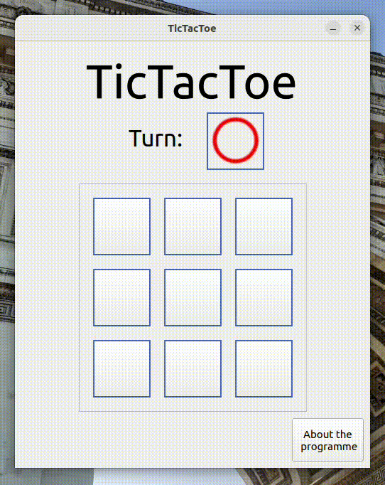

# Simple Tic Tac Toe

## Example how it works
### Tested on Python 3.10.6/Ubuntu 22.04.2 LTS x64

## How to run direct from the code
1. Open a console in ''code'' folder.
2. In the console, run: `python main.py`

## What you need to run
* PySide6/Qt
* Python 3